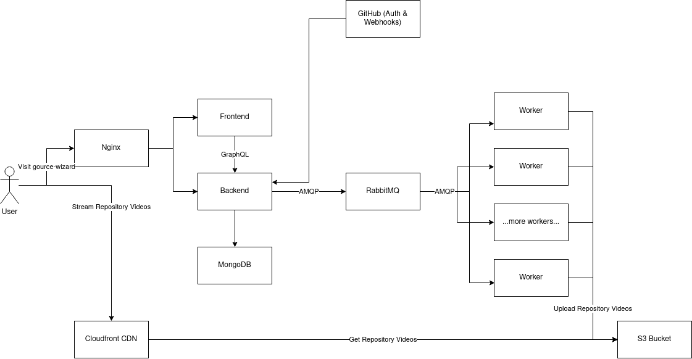
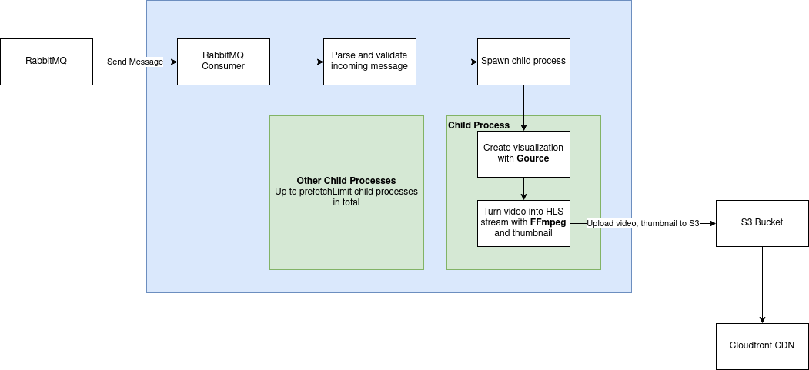

# Project sans-nom: Gource Wizard

## Project URL

https://gource-wizard.ryan.software

## Project Video URL 

**Task:** Provide the link to your youtube video. Please make sure the link works. 

## Project Description - Darren

**Task:** Provide a detailed description of your app

The Gource Wizard application performs two core 

## Development

**Task:** Leaving deployment aside, explain how the app is built. Please describe the overall code design and be specific about the programming languages, framework, libraries and third-party api that you have used. 

### Overall Architecture - Ryan

Draw a quick system diagram with all the players then talk about them at a low level.

- Talk about how we're using typescript and gsx.

### Front End - Darren

For the Front End we decided on using the Javascript library React due to our teams preference for React's component-based structure and past experience working with the library (including past projects, courses and assignments for this course). Instead of using vanilla CSS, we decided to use the CSS Library Tailwind due to it's excellent synergy with React. Tailwind offers thousands of built-in classes that allows you to create great layouts by styling elements directly. This synergizes well with React as it allows us to style our reusable components faster and not have to worry about creating various utility classes. 

### Back End - Robert

Talk about back end. GraphQL and stuff.

#### Authentication/Webhook with GitHub - Robert

Talk about GitHub.

#### Database - Robert

Talk about why we're using Mongo.

#### Message Queue - Ryan

Talk about why we're using Rabbit

### Worker - Ryan

Talk about how the worker works.

### Content Delivery Network - Ryan

Talk about content delivery network.

## Deployment - Ryan

**Task:** Explain how you have deployed your application. 

Production secrets are encrypted using [Mozilla SOPS](https://github.com/mozilla/sops).

Deployed on AWS to an t2.medium
- Database
- Rabbit
- Frontend
- Backend
- Prom/Grafana
- Sentry

Deployed on our school VMs
- 1 worker per group member = 3 workers total.

Security Group/Firewall
- Only incoming SSH from a non-standard port, HTTP on 80 for nginx. Frontend/Backend are not directly accessible, must go through nginx.
- Database not accessible unless you connect through SSH.
- TCP on a non-standard rabbit port.
- Rabbit requires authenticated, it is publicly accessible because we want to use our school nodes as

## Maintenance - Ryan

**Task:** Explain how you monitor your deployed app to make sure that everything is working as expected.

- Grafana
- Sentry
- UptimeRobot for basic uptime of the service.

- https://uptimerobot.com/
- RabbitMQ
- Logs are saved, we can look at nginx logs and our application logs at any time.

## Challenges - Darren/Robert

**Task:** What is the top 3 most challenging things that you have learned/developed for you app? Please restrict your answer to only three items. 

1.
2. Auth Stuff: Robert
3. Worker Stuff: Ryan, Video/CDN stuff.

## Contributions - Darren

**Task:** Describe the contribution of each team member to the project. Please provide the full name of each team member (but no student number). 

# One more thing? - Darren 

**Task:** Any additional comment you want to share with the course staff? 

We committed some secrets while developing, but we burned all of them ;)

If we had access to better servers (better specs, GPUs, ect.) then we could make the workers render videos faster.
