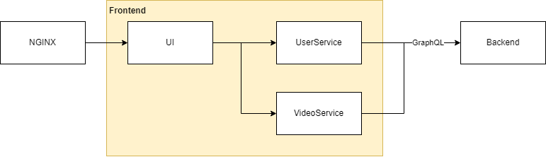
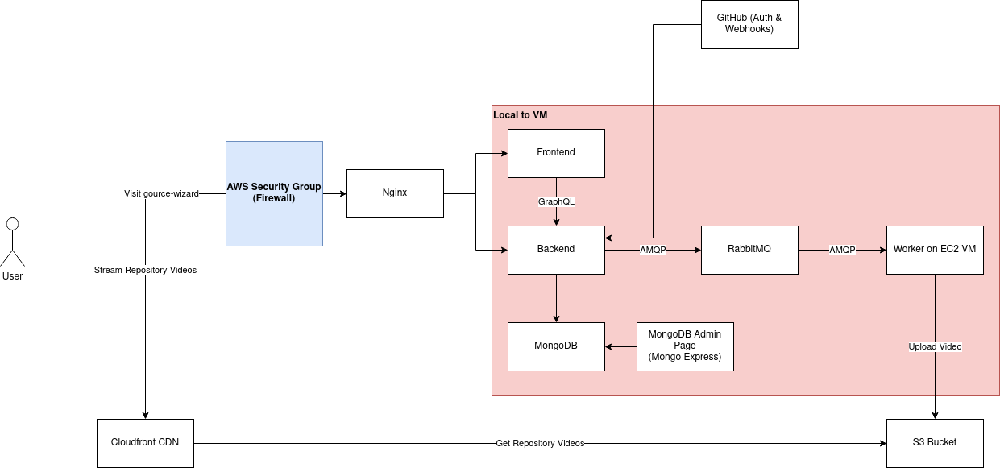
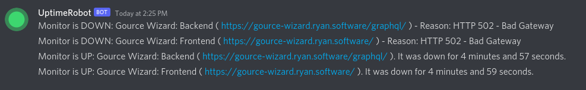

# Project sans-nom: Gource Wizard

## Project URL

https://gource-wizard.ryan.software

## Project Video URL 

**Task:** Provide the link to your youtube video. Please make sure the link works. 

## Project Description - Darren

The Gource Wizard application at it's core allows one to visualize their repositories as an animated tree with the directories as branches, and files as leaves, all without downloading any software. Simply log in using your Github Account and fill out the form and Gource Wizard servers will get to work on making your repo look the best it can. You can always come back later and look at your rendered videos again in the future, or create a link and share them with your friends.

There are various ways you can customize our video, such as:

- Changing the elasticity (alter the speed of physics for the file nodes in the tree)
- Render on every commit (this is accomplished using webhooks)
- Declare what section of the repository you want rendered

## Development

**Task:** Leaving deployment aside, explain how the app is built. Please describe the overall code design and be specific about the programming languages, framework, libraries and third-party api that you have used. 

### Overall Architecture

The Gource Wizard application has many components as seen above.

The user directly interacts with two parts of our app, the nginx reverse proxy and the Cloudfront CDN.

We use an Nginx reverse proxy (like [Week 8, Slide 21](https://thierrysans.me/CSCC09/lectures/08/slides/C09-Deploying/#21)), forwarding the user's requests to the React frontend or the GraphQL backend. We are using a reverse proxy as a layer of abstraction, so the outside world does not need to know about the implementation details of our app. Additionally, it simplifies our integration with GitHub, which we use for authentication and webhooks by having the frontend and backend on the same origin.

As stated in the project description, we visualize GitHub repositories. It takes time (minutes) to generate a video visualization of a GitHub repository. So it would not make sense to render the videos on the backend. Instead, we use RabbitMQ, a message queue which will send the render jobs to an available worker node using round-robin scheduling.

Moving the rendering to it's own service is done for three reasons. Firstly, we are able to follow best practices (Separation of Concerns, Coupling, Modularity) by keeping the video rendering service out of the backend so the backend can focus on doing one thing. Secondly, it would allow us to scale the limiting factor during periods of high traffic by spinning up new worker nodes. Lastly, we gain more reliability from using a message queue with less complexity. If we have parts of our application go down (e.g. backend), then we can still render videos as the video rendering system is decoupled from the rest of the application. Furthermore, if the message queue went down, messages which have not been processed by workers yet will still be in the queue once the message queue has gone back up.

Each worker node can accept a configurable number of render jobs (configured as `prefetchLimit` in the worker config), which it may do concurrently because the worker spawns a child process for each render job. The worker node uses [Gource](https://github.com/acaudwell/Gource/) to visualize the git repository, FFmpeg to create a HLS video (see below for rationale) then uploads the video along with a thumbnail to S3 bucket, which stores our media assets (videos/images). Our S3 bucket is not directly accessible, instead we use a CDN to serve our content.

We've developed the frontend, backend and the worker services using TypeScript to leverage the plentiful third party libraries/packages of JavaScript and have the reliability of typing from TypeScript. Our entire application has been dockerized from the beginning.

### Front End - Darren

For the Front End we decided on using the Javascript library React due to our teams preference for React's component-based structure and past experience working with the library (including past projects, courses and assignments for this course). Instead of using vanilla CSS, we decided to use the CSS Library Tailwind due to it's excellent synergy with React. Tailwind offers thousands of built-in classes that allows you to create great layouts by styling elements directly. This synergizes well with React as it allows us to style our reusable components faster and not have to worry about creating various utility classes. 

### Back End - Robert

Talk about back end. GraphQL and stuff.

#### Authentication/Webhook with GitHub - Robert

Talk about GitHub.

#### Database - Robert

Talk about why we're using Mongo.

### Worker

The worker was written in TypeScript and only communicates with our message queue, RabbitMQ over the AMQP protocol. It is decoupled from the other parts of the application for the previously mentioned reasons. It is good practice (Coupling, Separation of Concerns, SRP) to separate out code with different responsibilities, we are able to spin up more worker nodes if there is demand and we have some fault tolerance by using RabbitMQ. If parts of our application go down (e.g. backend), then we can still render videos due to the worker's separation with the backend. Additionally, we use durable queues and persistent messages in RabbitMQ, meaning messages from producers are immediately written to disk by Rabbit once received. Additionally, Rabbit can unexpectedly go down without data loss in our queues.

A producer (the backend) will send a message to RabbitMQ which contains parameters to render a video. Our application allows for many worker nodes to be connected to our message queue. RabbitMQ will use round-robin scheduling to deliver a message to an available worker. The worker will parse/validate/sanitize the arguments before spawning a child process. The child process will preform the following steps:
1. Visualize the Git repository using Gource and produce a HLS stream using FFmpeg
2. Create a thumbnail, which is the last frame of the stream. We assume this is an interesting frame to use because at the end of the visualization, we should have a large colourful graph.
3. Upload the HLS stream and the thumbnail to S3 (file storage).

To avoid a "thundering herd"-like issue, the worker has a configured limit of jobs it will accept at a given time. If there was a situation where we had a large number of render jobs suddenly, each worker would pick up their limit of render jobs while the remainder of the render jobs wait in the queue. Additionally, we have implemented a timeout where each repository can only be rendered for up to 10 minutes. After 10 minutes have passed, rendering stops and what was generated is uploaded to S3.

We're using a CDN to cache the content in our S3 bucket. This is better for the end user because they can get their image/video faster and it is better for us as we save money on bandwidth, since less requests are going to our S3 bucket. Furthermore, it would be much more complicated for us to create a comparable video serving system than a CDN and S3.

## Deployment

We have deployed our application on one AWS VM (`t2.medium`) and setup Cloudfront with our S3 bucket. We have only deployed one instance of everything, so that we can use a `t2.medium` VM. But note that the design of our application opens the door to more complicated deployments since our backend and worker are both stateless. We can have any number of backends and workers. If we had a high number of users, we would need more workers to render videos. We would spin up more worker nodes and connect them to RabbitMQ.

We have defined our production docker-compose file, called [docker-compose-prod.yml](docker-compose-prod.yml). Notice that all yaml values look like encrypted nonsense. We have production secrets (AWS Keys, Github App Credentials, ...) which are encrypted when saved in this Git repo. These production secrets are encrypted using [Mozilla SOPS](https://github.com/mozilla/sops). Group members can use sops to edit the encrypted production file in VSCode, which will handle the decryption/encryption. On the AWS VM, we have sops setup to decrypt the file and do a `docker-compose up`.

For convince we have provided [docker-compose-prod-unencrypted.yml](docker-compose-prod-unencrypted.yml) which is an unencrypted copy with the secrets set to "potato".

Since our entire application is containerized, our deployment is relatively simple. We have that docker-compose file to bring up one instance of the database (Mongo), message queue (RabbitMQ), frontend, backend, worker and administrative tools to view the database/message queue in an UI. Additionally, we setup a security group, only allowing incoming connections to port 22 (SSH) and 80/443 (HTTP/HTTPS). For security reasons, there are no other ports accepting incoming connections. So the administrative tools are not publicly accessible. One needs to use SSH port forwarding in order to access the administrative UIs for Mongo and RabbitMQ.

We have setup certbot with Nginx, using an `nginx-certbot` image to do so. This allows us to serve HTTPS traffic and automatically handle renewing our certs.

## Maintenance

We use UptimeRobot to monitor the uptime of three things:

As mentioned above, our backend actually serves files at `/` and any other url (e.g. `/library`) goes to the frontend from our nginx config. We use this behaviour to monitor the availability of our frontend and backend. UptimeRobot checks every 5 minutes if `https://gource-wizard.com/` (backend) and `https://gource-wizard.com/library` (frontend) are accessible.

We also uploaded a simple text file to S3, which is publicly accessible through our CDN. UptimeRobot checks this as well.

When the status of a monitored service goes down, we are notified in a shared Discord group. This will prompt us to check various logs (nginx, service logs, ...).

## Challenges - Darren/Robert

**Task:** What is the top 3 most challenging things that you have learned/developed for you app? Please restrict your answer to only three items. 

### Challenge 1 - Robert

1. Auth Stuff: Robert

### Challenge 2 - Worker

We initially outputted an MP4 video using FFmpeg to be uploaded to S3 and displayed to the end user using a regular `<video>` tag in the front end. This worked well for repositories that generated short videos but for large videos, we noticed a lot of buffering and waiting for the video to download. After learning more about how CDNs worked, we realized that the CDN was sending the entire video file in an inefficient way.

Instead, we use HLS to create a playlist (.m3u8) file which references 2 second segments (.ts files) of the video. Those short segments are cached better by the CDN, allow for better load times, scrubbing. Now the next few segments are streamed to the user as they watch the video instead of the entire video at load time. That is more efficient in terms of bandwidth (which we need to pay for because AWS) if the user does not watch the entire video and better UX. Streaming the video to the user required using `react-player` to play the HLS video, because not all browsers natively supported that. It was non-trivial to figure out how to get FFmpeg to create a HLS video with Gource. We ended up figuring out the correct parameters to pass into FFmpeg to consume a video input stream and output an HLS stream ready to be uploaded to S3. It took a many tries to create a HLS stream which worked properly, we made use of this debugging tool https://players.akamai.com/players/hlsjs because during development, we weren't sure the HLS stream was malformed or if our video player was incorrectly setup. We had one attempt where we used some FFmpeg arguments to create a HLS stream and play in most browsers, but it was unable to play in Firefox. We had some "codec not supported" errors. This was fixed by toggling different things with FFmpeg. Additionally, when uploading our segments to S3, we ran into a funny issue where S3 assumed our mime type was something wrong instead of `video/MP2T` which was a subtle and unexpected issue to debug.

### Challenge 3 - Frontend

3. One challenge we faced was using TailwindCSS. Although it has a great amount of utility classes, it sometimes was difficult to work with due to the no errors being raised when a certain class does not exist. For example, classes `w-1`, `w-1.5`, all the way to `w-12` are defined. `w-50` is not, and as a result using `w-50` would be like just not using a width class at all. Furthermore due to the teams inexperience with CSS, it was slow to get used to the utility classes of Tailwind since they often have less descriptive names are intended with people who are already comfortable with vanilla CSS. Often the pipeline would be looking at how to solve a problem in vanilla  CSS, and then looking up the corresponding utility class in Tailwind which is slow. Although once the team was comfortable with Tailwind, it proed to allow for faster development and more customizable styling. 

## Contributions - Darren

**Task:** Describe the contribution of each team member to the project. Please provide the full name of each team member (but no student number). 

**Robert Nichita**

Robert was primarily responsible for most of the backend tasks. This includes setting up the GraphQL schema, validation of inputs to the backend and to the worker, and authentication. Robert was tasked with allowing users to log in with their Github accounts, and setting up support for webhooks to allow the backend to perform tasks on each commit to the user's repository. Robert also setup Google TypeScript Style (GTS) for the project to allow for consistent linting and automatic code fixes. Robert also assisted Ryan with the deployment of the applications.

**Ryan Sue**

Ryan was primarily responsible for creating the worker service (which renders and generates the videos using Gource) and serving the content from the worker to the backend swiftly. Furthermore he also did some development on the frontend such as creating the landing page for when a video render fails, and writing the services the frontend used to communicate with the server. Ryan was also the lead when deploying the application, having wrote the docker-compose files needed for deployment and a lot of the necessary setup.

**Darren Liu**

Darren's primary responsibility was designing and creating the UI. This includes creating the various UI components such as a custom class for buttons, validation of inputs in the frontend, and setting up routing for the frontend. Darren also set up protected routes, so any unauthenticated users could not view content they were not authenticated for and would be redirected to the login page. Furthermore he was also responsible for the TailwindCSS setup, which facilitated buiding complex responsive layouts much easier.

# One more thing? - Darren 

**Task:** Any additional comment you want to share with the course staff? 

If we had access to better servers (with better specs, GPUs, etc.) we could make the workers render videos faster and be able to process larger repositories.